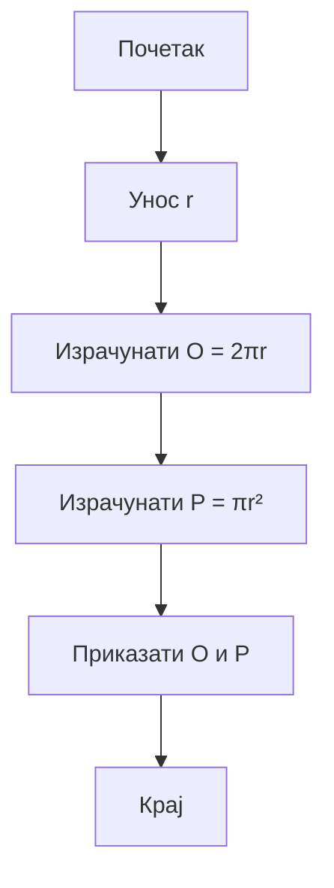

# 1. Домаћи задатак из Техничке документације

## 2. Задатак

Програм који на основу унете дужине **полупречника** круга *r* израчунава:

- **Обим** круга O  
- **Површину** круга P  

Формуле:
- Обим:  
  **O = 2πr**
- Површина:  
  **P = πr²**

---

### 3. Алгоритамска шема



## 4. Решење
```csharp
class Program
{
    static void Main()
    {
        Console.Write("Унесите полупречник круга r: ");
        double r = double.Parse(Console.ReadLine());

        double O = 2 * Math.PI * r;
        double P = Math.PI * r * r;

        Console.WriteLine($"Обим круга: {O}");
        Console.WriteLine($"Површина круга: {P}");
    }
}
```
### 5. Тест примери

 **Пример 1**
- Унос: **r = 5**
- Резултат:
 - O = 31.4159…
 - P = 78.5398…

 **Пример 2**
- Унос: **r = 2.5**
- Резултат:
  - O = 15.7079…
  - P = 19.6349…
 
### 6. Објекти
| Назив променљиве | Тип    | Опис              |
| ---------------- | ------ | ----------------- |
| r                | double | Полупречник круга |
| O                | double | Обим круга        |
| P                | double | Површина круга    |


